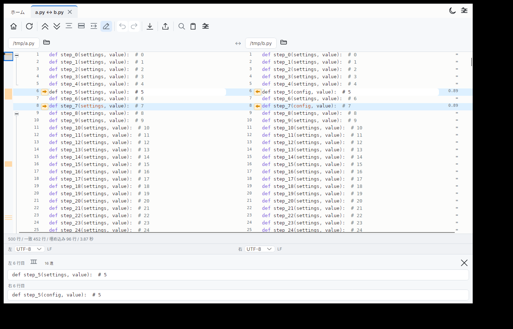
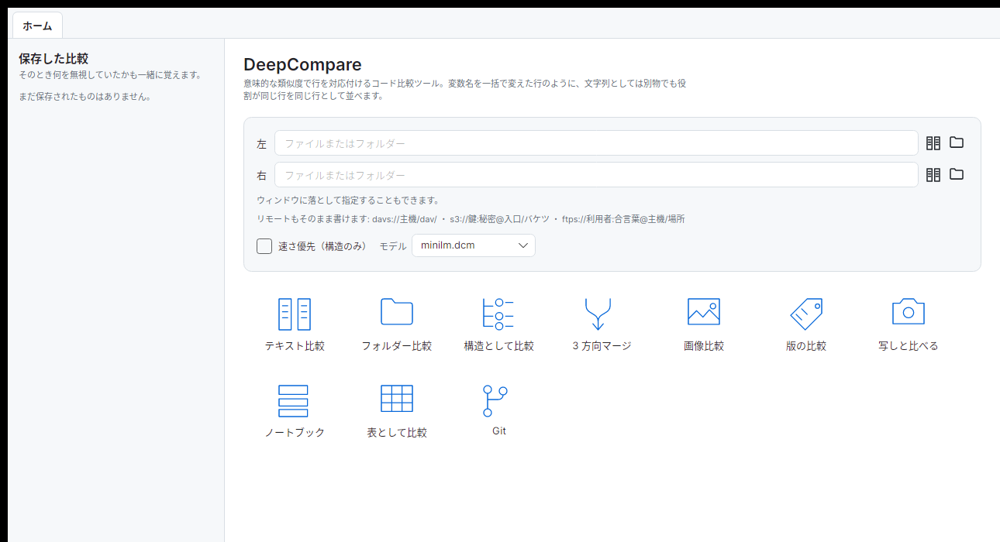
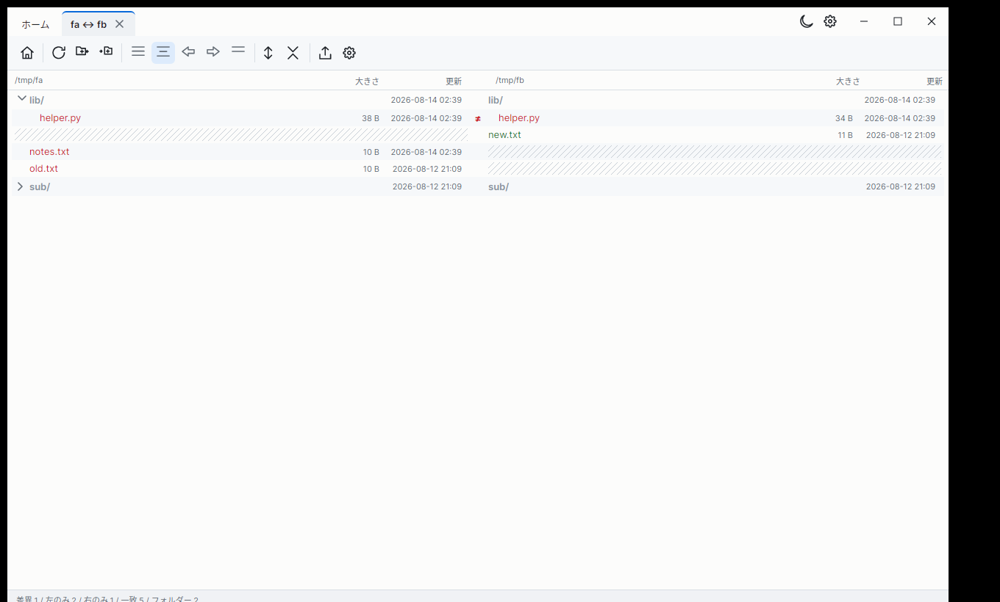
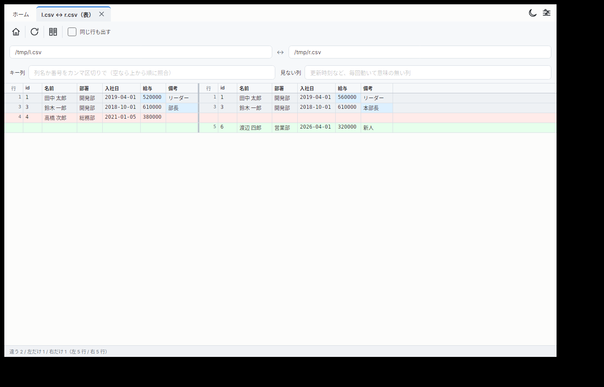
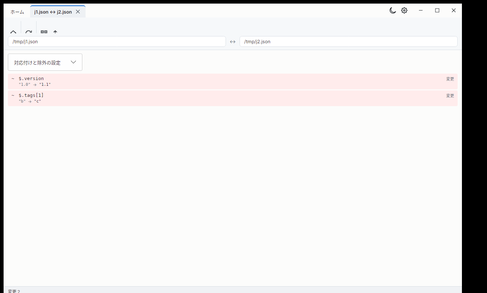
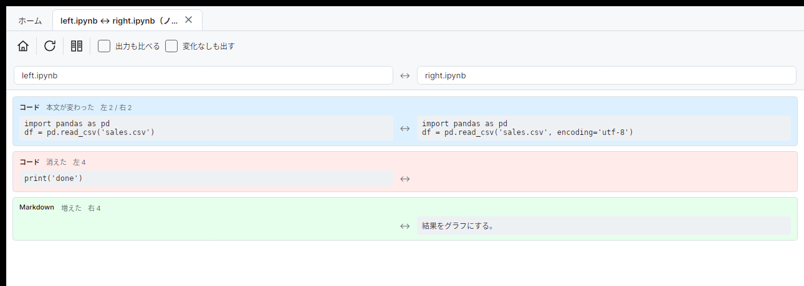
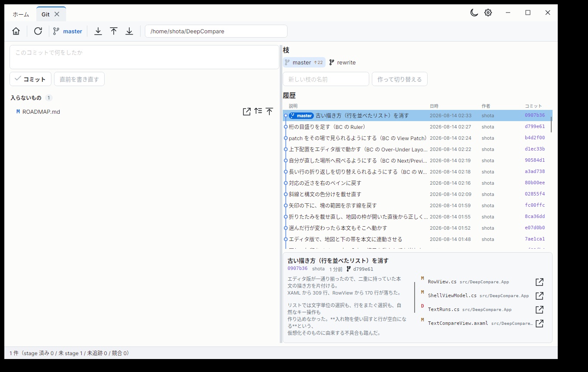

# DeepCompare

**ファイルとフォルダーを見比べるための道具。**
どこが違うのかを左右に並べて示し、片方からもう片方へ反映できる。

行を突き合わせるとき、文字が一致するかだけでなく**書いてある内容が近いか**も見る。
上の例では `settings` を `config` に、`f` を `handle` に一括で変えている。
どの行も書き換わっているのに、同じ役割の行が横に並ぶ（右端の数字が近さ）。
順番の入れ替わりも、消えた／増えたではなく**移動**として扱われる。

こういうものを比べられる:

| | |
|---|---|
| テキスト | 意味的な行の対応付け・行内差分・構文強調 |
| フォルダー | 再帰的に走査。名前が変わっただけのファイルも見つける |
| 表（CSV / TSV） | キー列で行を照合。並び順が違っても対応する |
| 構造（JSON / XML / TOML / YAML） | キーの順序や整形の違いを差分にしない |
| ノートブック（.ipynb） | セル単位。実行しただけの差分を出さない |
| Office（.docx / .xlsx / .pptx） | 本文だけを取り出す |
| 画像 | 画素で比べる。大きさが違っても重なる範囲は比べる |
| Windows の実行ファイル | 版・会社名・説明を並べる（.exe / .dll） |
| Git | 作業ツリーと履歴。変更の塊ごとにコミットへ含められる |
| 書庫（zip / tar / tar.gz） | 中身をフォルダーとして扱う |
| リモート | `sftp://` `s3://` `dav(s)://` `ftp(s)://` をパスの位置に書ける |

Windows と Linux で動く。

---

# 使う

## 入手する

[リリースページ](https://github.com/monyuonyu/DeepCompare/releases)から
自分の環境のものを落とす。

| | |
|---|---|
| Windows | `deepcompare-windows-x64.zip` |
| Linux | `deepcompare-linux-x64.tar.gz` |

展開して `deepcompare`（Windows は `deepcompare.exe`）を実行するだけ。
**インストールは要らない。** .NET も Python も入れなくてよい。

落とすのは 40MB ほど、展開すると 68MB。半分は `minilm.dcm`（意味的な
対応付けの中身）で、**実行ファイルと同じ場所に置いたままにする。**

### Windows で「保護されました」と出るとき

初回だけ、青い画面で「WindowsによってPCが保護されました」と止められる。
**署名を買っていないため**で、中身の問題ではない。

「詳細情報」→「実行」で進める。信用できないなら、進めずに
[コード](https://github.com/monyuonyu/DeepCompare)を読んでから自分で組み立てる方が確実。

---

## 画面

### 起動画面

比較するものを 2 つ指定する。ファイルでもフォルダーでも、落として入れてもよい。
**種類は選ばない** — 渡されたものを見て、テキスト・フォルダー・表・ノートブック・
画像のどれで開くかが決まる。

### フォルダー比較

**差異を含むフォルダーだけが開く**（差異の無い `tests/` は閉じたまま）。
行を開くとテキスト比較へ移る。

### 表として比較（CSV / TSV）

列の幅を左右で揃えて並べるので、縦に見比べられる。
キー列に `id` を指定してあるので、左の 1 行目と右の 2 行目が同じ行として
並んでいる。**変わったセルだけが青い。** `updated` は「見ない列」に
入れてあるので、日付が全行で動いていても差分にならない。

キー列と見ない列は画面の入力欄で指定する（起動の引数でも渡せる）。

### 構造として比較（JSON / XML / TOML / YAML）

**型の変化は `!` で明示する**（`8080` → `"8080"` は目で見て気づけない差の筆頭）。

### ノートブック（.ipynb）

**既定では出力と実行回数を見ない。** 実行しただけで出力が数千行動き、
直した 1 行がその中に埋もれるため。見たいときは「出力も比べる」を入れる。

## キーボードで操る

| キー | すること |
|---|---|
| `F3` / `Shift+F3` | 次を探す / 前を探す |
| `Alt+↓` / `Alt+↑` | 次の差分へ / 前の差分へ |
| `Ctrl+Alt+↓` / `Ctrl+Alt+↑` | 自分が直した次の場所へ / 前の場所へ |
| `Ctrl+G` | 行番号を指定して飛ぶ |
| `Ctrl+Z` / `Ctrl+Y` | 取り消し / やり直し |
| `F5` | 比べ直す |
| `Ctrl+S` | 左を保存 |

`Ctrl+F` で検索、`Ctrl+H` で置換、`Esc` で閉じる。
**置換しても読み取り専用の側は触らず、取り消しで戻せる。**

フォルダー比較では:

| キー | すること |
|---|---|
| `↑` / `↓` | 行を移る |
| `→` | フォルダーを開く / 中へ入る |
| `←` | フォルダーを閉じる / 親へ戻る |
| `Enter` | 新しいタブで比べる |

### Git

VS Code と同じ並びで、上に説明、下に「次のコミットに入るもの」と「入らないもの」。
差分の見え方はテキスト比較と同じなので、変数名を変えた行も並んで見える。
コミット・枝の作成と切り替え・取得・送信・打ち消し、衝突の解決までできる。

## 日本語ならモデルを差し替える

**既定のモデルは英語向けで、日本語ではうまく対応付けられない。**
濁点が落ちるので「バグ」と「ハク」を同じ行と見る。日本語が半分を超える
ファイルを開くと、その旨を画面に出す。

日本語を扱うなら、多言語モデルを置く。**リリースには含めていない**
（114MB 増え、起動が 2 秒ほど遅くなるので、要る人だけが置く形にした）。

作り方は[後半](#多言語モデルを作る)にある。できた 2 つのファイルを
`minilm.dcm` の隣へ**対で**置けばよい（名前を揃えるところで対応を取っている）。
GUI なら設定から選べる。CLI なら `--model multilingual.dcm`。

どのくらい効くかを測った表は [docs/design.md](docs/design.md) にある。

---

## 画面を開かずに使う（CI・遠隔）

遠隔での検証や CI で、別環境の出力と機械的に突き合わせるために用意した。

    deepcompare --print 左 右          行を対応付けて 1 行 1 レコードで出す
    deepcompare --print-folder 左 右   フォルダーを比べて一覧にする
    deepcompare --print-json 左 右     構造として比べる（JSON / XML / TOML / YAML）
    deepcompare --print-table 左 右    表として比べる（--key で行を照合）
    deepcompare --secrets ファイル     秘密が混ざっていないか調べる
    deepcompare --invisible ファイル   「同じに見えるのに一致しない」原因を調べる

**終了コードが差分の有無を表す**（0 差異なし / 1 差異あり / 2 異常）ので、
そのまま CI の判定に使える。`--help` に全部載っている。

`-o 出力` を付けるとファイルへ書く。Windows の GUI 版 exe には標準出力が
繋がらないので、遠隔から結果を回収するときはこれを使う。

## LLM に助けてもらう（任意）

git の状態を平易な言葉で説明し、次にできることを挙げる。コミットメッセージの
草案も書く。**接続先を設定するまで機能そのものが現れない。**

**外部 API ではなくローカルの LLM を第一の経路にしている。** 業務コードを扱う
道具なので、中身が機械の外に出ないことは譲れない。接続先は OpenAI 互換の
エンドポイント（Ollama / LM Studio / llama.cpp）を URL で指定する。

    export DEEPCOMPARE_ASSIST_ENDPOINT=http://localhost:11434/v1
    export DEEPCOMPARE_ASSIST_MODEL=qwen2.5:7b

    deepcompare --assist-probe            繋がるかを確かめる
    deepcompare --assist-status .         いまの状態を説明し、次の一手を挙げる
    deepcompare --assist-commit . --staged コミットメッセージの草案

GUI では Git 画面に「いまの状態を説明」「草案をもらう」が出る。

**7B 以上のモデルを勧める。** それより小さいと、状態の説明が「現在の
リポジトリの状態は以下の通りです」で終わって中身が無い。CPU では 1 分ほどかかる。

安全のために決めていること:

- **LLM に git を実行させない。** 返せるのは決まった操作（commit / pull /
  push / stash / …）からの選択だけ。リポジトリの中身に「すべて削除せよ」と
  書いてあっても命令にならないのは、**通す経路が無いから**。
  force push・reset --hard・リベースは選択肢にすら入れていない
- **衝突の解決案は既定で出さない。** 説明と違って意味を取り違えると害になり、
  7B でも平気で間違える（引数を 1 つ落としたまま、構文としては正しいコードを
  出してくる）。`--assist-allow-resolution` で許すまで通信もしない
- **鍵は設定ファイルに置かない**（平文で残り、バックアップにも同期にも乗る）。
  外部 API を使うなら `DEEPCOMPARE_ASSIST_KEY` に入れる

測った結果は [docs/design.md](docs/design.md) にある。

---

# 作る

## 構成

    src/
      DeepCompare.Engine/     比較エンジン。**画面にも通信にも依存しない**
      DeepCompare.App/        Avalonia の画面と CLI
      DeepCompare.Assist/     LLM 支援（任意）。**Engine を参照しない**
      DeepCompare.ModelPrep/  モデルを int8 へ変換する開発用ツール
    tests/                    試験（789 件）
    tools/                    参照実装との突き合わせ・CLI の確認
    assets/                   埋め込みモデルの実体
    docs/images/              README のスクリーンショット

**依存の向きを構造で示している。** Engine は Assist を知らないので、
比較の経路に通信が紛れ込む余地が無い。App だけが両方を知る。

比べ方を変えたいなら `Engine`、見え方を変えたいなら `App`。
**Engine は画面を持たないので、CLI と試験だけで確かめられる。**

---

## ビルド

.NET 10 SDK が要る。それ以外の下準備は無い。

    dotnet run --project src/DeepCompare.App/DeepCompare.App.csproj

試験（749 件と 40 件。GUI に依存しないので画面の無い環境でも走る）:

    dotnet test tests/DeepCompare.Engine.Tests/DeepCompare.Engine.Tests.csproj
    dotnet test tests/DeepCompare.Assist.Tests/DeepCompare.Assist.Tests.csproj

**画面を開かない経路**が壊れていないかの確認（終了コードを見る）:

    dotnet build src/DeepCompare.App/DeepCompare.App.csproj
    ./tools/cli-smoke.sh src/DeepCompare.App/bin/Debug/net10.0/deepcompare

### リリースを出す

**タグを打つと CI が作って Release へ添える。** 手元で発行する必要は無い。

    git tag -a v0.0.1 -m "..."
    git push origin v0.0.1

Windows と Linux の両方を作り、**試験を通してから**添える
（[.github/workflows/release.yml](.github/workflows/release.yml)）。
タグを打つ前に試したいときは、Actions から `release` を手で走らせる
（下書きとして作られる）。

手元で発行するなら:

    dotnet publish src/DeepCompare.App/DeepCompare.App.csproj -c Release -r linux-x64 -p:PublishAot=true -o out

リンクに要るもの: Linux は `clang` と `zlib1g-dev`。
Windows は MSVC（Visual Studio Build Tools の C++ ワークロード）。

### 多言語モデルを作る

日本語で使うためのもの（[前半](#日本語ならモデルを差し替える)を参照）。

    B=https://huggingface.co/sentence-transformers/paraphrase-multilingual-MiniLM-L12-v2/resolve/main
    curl -sSLO $B/model.safetensors
    curl -sSL -o unigram.json $B/unigram.json

    # 語彙を「トークン<TAB>スコア」の形へ
    python3 -c "import json;d=json.load(open('unigram.json'));print('\n'.join(f'{t}\t{s}' for t,s in d['vocab']))" \
        > multilingual.vocab

    dotnet run --project src/DeepCompare.ModelPrep/DeepCompare.ModelPrep.csproj -c Release \
        -- model.safetensors multilingual.dcm

### 既定のモデルを作り直す

`assets/minilm.dcm` は追跡しているので通常は不要。作り直す場合:

    mkdir -p assets/src && cd assets/src
    B=https://huggingface.co/sentence-transformers/paraphrase-MiniLM-L6-v2/resolve/main
    curl -sSLO $B/model.safetensors && curl -sSLO $B/vocab.txt
    cd ../..
    dotnet run --project src/DeepCompare.ModelPrep/DeepCompare.ModelPrep.csproj -c Release \
        -- assets/src/model.safetensors assets/minilm.dcm

参照実装との突き合わせをやり直す場合は、加えて ONNX 版と検証用の環境が要る:

    curl -sSL -o assets/src/model.onnx $B/onnx/model.onnx
    python3 -m venv .venv-ref && .venv-ref/bin/pip install onnxruntime numpy tokenizers
    .venv-ref/bin/python tools/reference_embeddings.py

## 設計上の判断

なぜその作りにしたかは [docs/design.md](docs/design.md) にある。
重みを int8 で自前量子化した理由、前向き計算の正しさをどう担保しているか、
対応付けを二段に分ける理由、実装中に見つけた道具側の問題（`BertTokenizer` が
記号を黙って捨てる、.NET のコードページ 20932 が不正な EUC-JP を受理する）。

作業の記録と、これから何をするかは [ROADMAP.md](ROADMAP.md)。

## 履歴

元は Python + PyQt6 + sentence-transformers（タグ `python-legacy`）。
配布が数百 MB になるのを理由に書き直した。

途中で Rust + egui + candle の実装も経ている（コミット `1ce2d16`）。
同じ重みを使い、比較結果は C# 版と完全に一致していた。

比較の考え方——**意味的な類似度で行を対応付ける**——は最初の実装で固まっており、
書き直しで変わったのは配布の形と、その周りに足した機能。

## ライセンス

MIT（`LICENSE`）。モデルは
[sentence-transformers/paraphrase-MiniLM-L6-v2](https://huggingface.co/sentence-transformers/paraphrase-MiniLM-L6-v2)
（Apache-2.0）。
